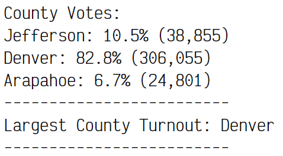
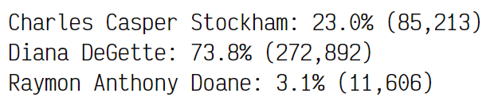

# Election Analysis

## Audit Overview
An election audit has been requested by a Colorado Elections Commison in order to automate election analysis in Python for local congressional elections. Given a CSV file with the data, the script should do the following:

1. Calculate the total number of votes cast.
2. Get a complete list of candidates who recieved votes.
3. Calculate the total number of votes each candidate recieved.
4. Calculate the percentage of votes each candidate won.
5. Determine the winner of the election based on popular vote.
6. Get a complete list of counties from which votes were cast.
7. Calculate the total number of votes cast in each county.
4. Calculate the percentage of votes cast in each county.
6. Determine the county with the highest turnout.

## Resources
- Data Source: `resources/election_results.csv`
- Software: Python 3.10.6, VS Code 1.71.1

## Data Format
The data is comma-separated with 3 columns. The first row is a header row reading `Ballot ID,County,Candidate`. Only the County column and Candidate column are explicitly used in the analysis. The Ballot ID provides assurance against duplicate counts. 

## Challenge Overview
The election audit was requested not only for
- There were 369,711 votes cast in this election, for 3 different candidates in 3 Colorado counties.
- The vast majority (82.8%) of votes came from Denver county (306,055).
- The other 2 counties had relatively similar voter turnout counts as seen below:

- Of the 3 candidates, Diana DeGette won the election by simple majority, winning 272,892 votes, which is 73.8%.
- Charles Casper Stockham recieved almost a quarter of the votes (23.0%) with a count of 85,213.
- Lastly, Raymon Anthony Doane recieved 11,606 votes, good for 3.1 percent.

## Challenge Summary
This script can be used for any election with similar data input. The current version of the script does two basic analyses: on candidates and on counties. There is an opportunity to modify and improve the script to drill-down county by county and give candidate results in each county, to analyze over or under-performance in different localities. Another very basic modification to ensure election security would be to run the script over the `Ballot ID` column to ensure validity and uniqueness so that votes are with certainty counted only once.